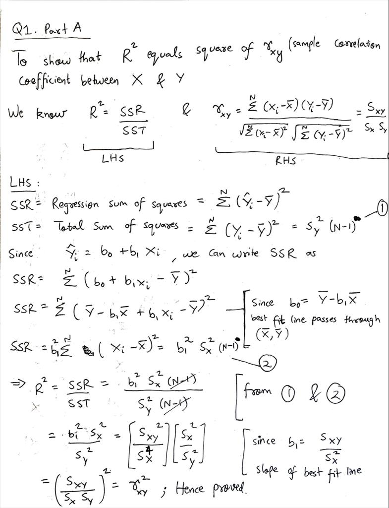
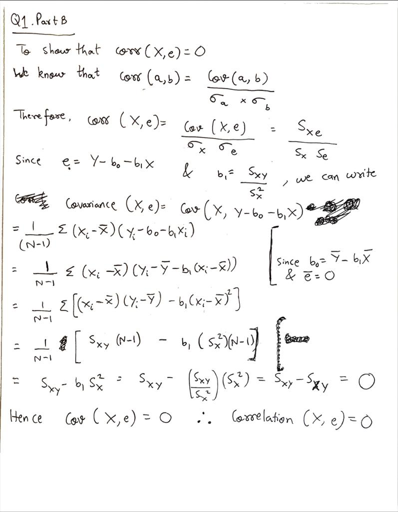

---
header-includes:
- \usepackage{amssymb, amsmath, amsthm}
- \usepackage{tabu}
- \newcommand{\E}{\mathbb{E}}
- \newcommand{\var}{{\rm Var}}
- \newcommand{\N}{\mathcal{N}}
output:
  html_document:
    df_print: paged
---

\noindent \begin{tabu} to \textwidth {@{}X[4 l] @{}X[r]}
  \textbf{Homework 2}           & \\ 
  \textbf{MSBA 400: Statistical Foundations for Data Analytics}   & \\ 
  \textbf{Professor Rossi}         & 
\end{tabu}

\bigskip


## Question 1

### Q1, part A
In the class notes, we introduced the concept of $R^2$. Show that the formula $R^2=\frac{SSR}{SST}$ implies that $R^2$ is the square of the sample correlation coefficient between $X$ and $Y$, $r_{XY}$. Hint: recall from the notes how the fitted regression line can be expressed in terms of deviations from the mean.

<br>

**Answer 1.A:**



<br>
<br>

### Q1, part B
In the class notes, we used intuition to argue the regression property, $corr(X,e)=0$. Show this directly results from the formula for $b_1$. Hint: substitute, $e_i = Y_i - b_0 - b_1X_i$ into $corr(X,e)$. 

<br>

**Answer 1.B:**



<br>
<br>

## Question 2 : More on Nearest Neighbor Approaches

The simplest view of nearest neighbor methods is to "slice" into the data for only a small interval of X values. This distribution is called the conditional distribution of Y given X.

### Q 2, part A

Display a histogram of the conditional distribution of emv given that luxury is in the interval (.2, .3) in the cars dataset (from problem set 1).

<br>

**Answer 2.A:**

```{r}
# Loading the required libraries
library(DataAnalytics)

# Loading mvehicles dataset
data(mvehicles)

# Filtering only cars from the mvehicles dataset
cars = mvehicles[mvehicles$bodytype != "Truck",]

# Filtering cars dataset to only keep cars with luxury index between (0.2, 0.3)
cars_subset = cars[(cars$luxury > 0.2 & cars$luxury < 0.3),]

# Plotting histogram of emv metric for cars with luxury index between (0.2, 0.3)
hist(cars_subset$emv, main = "Histogram of emv for cars with luxury index between (0.2, 0.3)", 
     xlab = "emv", ylab = "Frequency", breaks = 15)

```

<br>
<br>

### Q 2, part B

Compute the mean of the conditional distribution in part A and compute a prediction interval that takes up 95% of the data (an interval that stretches from the .025 quantile (2.5 percentile) to the .975 (97.5 percentile)). Use the `quantile()` command.

<br>

**Answer 2.B:**

```{r}
# Mean emv for cars with luxury index between (0.2, 0.3)
mean_emv = mean(cars_subset$emv)
print(paste0("The mean emv for cars with luxury index between (0.2, 0.3) is $",
             sprintf(mean_emv, fmt = '%#.0f')))

```

<br>

```{r}
# Prediction interval that takes up 95% of the cars_subset data
pred_interval = quantile(cars_subset$emv, probs = c(0.025,0.975))
print(pred_interval)
```

<br>
<br>

### Q 2, part C

Repeat part A and B for a much higher level of luxury, namely the interval (.7,.8).  Describe the difference between these two conditional distributions.

<br>

**Answer 2.C:**

```{r}
# Filtering cars dataset to only keep cars with luxury index between (0.7, 0.8)
cars_subset_2 = cars[(cars$luxury > 0.7 & cars$luxury < 0.8),]

# Plotting histogram of emv metric for cars with luxury index between (0.2, 0.3)
hist(cars_subset_2$emv, main = "Histogram of emv for cars with luxury index between (0.7, 0.8)", 
     xlab = "emv", ylab = "Frequency", breaks = 15)

```

<br>

```{r}
# Mean emv for cars with luxury index between (0.7, 0.8)
mean_emv_2 = mean(cars_subset_2$emv)
print(paste0("The mean emv for cars with luxury index between (0.7, 0.8) is $",
             sprintf(mean_emv_2, fmt = '%#.0f')))

```

<br>

```{r}
# Prediction interval that takes up 95% of the cars_subset data
pred_interval_2 = quantile(cars_subset_2$emv, probs = c(0.025,0.975))
print(pred_interval_2)

```

<br>

The key differences between the two conditional distributions is that-

1. The `emv` value appears to increase as the luxury index increases (as it is expected- more luxurious the car, more expensive it would be).

2. The conditional distribution having luxury index interval (0.2, 0.3) has the peak approximately in the middle, whereas the second distribution (i.e. luxury index interval 0.7 to 0.8) is highly right-skewed. This can be validated by the mean `emv` values for both the conditional distributions. For the first distribution, the mean `emv` is $23.3k, which is approximately the middle value in the distribution. In contrast, the mean `emv` value for the second distribution is much closer to its lower bound `emv` value.

3. The final difference is in the range of `emv` values that lie within the 95% CI of mean `emv` for each of the two conditional distributions. In the first conditional distribution (i.e. luxury index between 0.2 and 0.3), we see the range for 95% CI around mean `emv` is ~\$23933. In the second conditional distribution, the 95% CI range around mean `emv` is ~\$144925. This value is ~6x times the 95% CI of the first conditional distribution (i.e. between 0.2 and 0.3). This implies the variance in `emv` is much higher in the second conditional distribution as compared to that of the first one.

<br>
<br>

### Q 2, part D

Explain why the results of part B and C show that luxury is probably (by itself) not sufficiently informative to give highly accurate predictions of `emv`.

<br>

**Answer 2.D:** The 95% confidence interval is quite wide compared to the mean `emv` value within each luxury index range. In part B, we can see that the 95% confidence interval range of `emv` values is almost similar to the mean `emv` value in that range of luxury index (0.2, 0.3). But as we increase the luxury index range to (0.7, 0.8), we see that the 95% confidence interval is more than twice the mean `emv` value. This implies the variance of the conditional distribution of `emv` given luxury index is high, and hence the luxury index only explains a small proportion of variance in `emv`. Hence, luxury index is by itself not sufficiently informative to give highly accurate predictions of `emv`. 

<br>
<br>

## Question 3 : Optimal Pricing and Elasticities

### Q 3, part A

Use the `detergent` dataset to determine the price elasticity of demand for 128 oz Tide.  Compute the 90 percent confidence interval for this elasticity.

<br>

**Answer 3.A:**

```{r}
library(ggplot2)

# Load detergent dataset
data("detergent")

# Plotting the price vs. quantity plot for Tide
qplot(p_tide128,q_tide128, log = "xy", data = detergent, col = I("blue"), alpha = I(1/3),
      main = "Log(Price) vs Log(Quantity) Plot for Tide", xlab = "Log(Price)", ylab = "Log(Quantity)") + theme_bw()

```

<br>

```{r}
# Fitting a linear model to the data
tide_lm = lm(log(q_tide128)~log(p_tide128), data = detergent)

# Summary of the linear model
summary(tide_lm)
```
<br>

We know that, for a log-log linear model of price vs.quantity, the price elasticity estimate is the same as the slope estimate of the linear model.

$$Price~Elasticity  = {\frac{\frac{\Delta q}{q}}{\frac{\Delta p}{p}}} \approx \frac{\Delta log(q)}{\Delta log(p)} =  Slope~of~log-log~linear~model$$
<br>

```{r}
print(paste0("Hence, the price elasticity estimate is ",sprintf(tide_lm$coefficients[2], fmt = '%#.2f')))
```
<br>

The 90% confidence interval for price elasticity estimate is between
```{r}

print(sprintf(confint(tide_lm, level = 0.90)[c(2,4)], fmt = '%#.2f'))
```

<br>
<br>

### Q 3, part B

One simple rule of pricing is the “inverse elasticity” rule that the optimal gross margin should be equal to the reciprocal of the absolute value of the price elasticity, i.e. $\text{Gross Margin}=\frac {1}{|elasticity|}$. For example, suppose we estimate that the price elasticity is -2 (a 1 per cent increase in price will reduce sales (in units) by 2 per cent. Then the optimal gross margin is 50 percent. 

Suppose this retailer is earning a 25 per cent gross margin on 128 oz Tide. Perform appropriate hypothesis test to check if the retailer is pricing optimally at the 90 per cent confidence level?

Hints:  
i. use the inverse elasticity rule to determine what elasticity is consistent with a 25 per cent gross margin.  
ii. Use the confidence interval!

<br>

**Answer 3.B:** 

In Part 3.C, we have seen that the 90% confidence interval for price elasticity is (-4.52, -4.31). Hence the 90% confidence interval for Gross Margin will lie between (22.12%, 23.20%). Since the retailer is charging 25% gross margin on the product; which does not lie within the 90% confidence interval for optimal gross margin estimate, the retailer is not optimally pricing the product.  

<br>
<br>

### Questions 4-5 explore the sampling properties of least squares

<br>

## Question 4

a. Write your own function in `R` (using `function()`) to simulate from a simple regression model. This function should accept as inputs: $b_0$ (intercept), $b_1$ (slope), $X$ (a vector of values), and $\sigma$ (error standard deviation). You will need to use `rnorm()` to simulate errors from the normal distribution. The function should return a vector of $Y$ values. 

<br>

**Answer 4.A:**

```{r}
# Function to simulate simple linear regression
simulate_simple_linear_regression <- function(arg_intercept, arg_slope, arg_x, arg_err_std_dev) {

  # Simulate errors
  error_vector = rnorm(n = length(arg_x), mean = 0, sd = arg_err_std_dev)
  
  # Estimated Y values
  y_hat = arg_intercept + (arg_slope * arg_x)
  
  # Simulated actual Y values
  y_actual = y_hat + error_vector
  
  return(y_actual)
   
}

```

<br>

```{r}
# Simulate simple linear regression
sample_x_vals = seq(from = 1, to = 20, by = 1)
simulated_y_vals = simulate_simple_linear_regression(arg_intercept = 0.1, 
                                                     arg_slope = 1,
                                                     arg_x = sample_x_vals,
                                                     arg_err_std_dev = 0.05)
print(simulated_y_vals)

```

<br>
<br>

b. Simulate $Y$ values from your function and make a scatterplot of $X$ versus simulated $Y$. When simulating, use the `vwretd` data from the `marketRf` dataset as the $X$ vector, and choose $b_0=1$, $b_1=20$, and $\sigma=1$. Then add the fitted regression line to the plot as well as the true conditional mean line (the function `abline()` may be helpful).

<br>

**Answer 4.B:**

```{r}
# Load data
data("marketRf")

# Initialize x values and simulate corresponding y values
x_vals = marketRf$vwretd
simulated_y_vals = simulate_simple_linear_regression(arg_intercept = 1, 
                                                     arg_slope = 20,
                                                     arg_x = x_vals,
                                                     arg_err_std_dev = 1)

# Fit simple linear regression line
fitted_y_vals = lm(simulated_y_vals~x_vals)

# Plot the values
plot(x = x_vals, y = simulated_y_vals,
     xlab = "vwretd")

# Plotting the fitted line over the simulated data points
abline(fitted_y_vals, col = 'red')

# Plotting the true conditional mean line ('a' parameter is the intercept, 'b' parameter is the slope in the below code) 
abline(a = 1, b = 20, col = "green", lwd = 2)

legend(x = "topleft", legend=c("Best Fit Line", "True Conditional Mean Line"), 
       fill = c("red","green"))

```

<br>
<br>

## Question 5

Assume $Y = \beta_0 + \beta_1X + \varepsilon$ with $\varepsilon \sim \N(0,\sigma^2)$. Let $\beta_0 = 2$, $\beta_1 = 0.6$, and $\sigma^2 = 2$. You can make $X$ whatever you like, for example you could simulate X from a uniform distribution

a. Use your `R` function from question 4 to simulate the sampling distribution of the slope. Use a sample size of $N=300$ and calculate $b_0$ \& $b_1$ for 10,000 samples. Plot a histogram of the sampling distribution of $b_0$.

<br>

**Answer 5.A:**

```{r}

# Creating an empty list to store the estimated intercept
est_intercept <- rep(NA, 10000)

# Creating an empty list to store the estimated slope
est_slope <- rep(NA, 10000)

# Running a loop to create a sample of 300 observations
for (i in 1:10000) {
  
  x_vals_2 = runif(n = 300, min = 0, max = 50)
  simulated_y_vals_2 = simulate_simple_linear_regression(arg_intercept = 2, 
                                                     arg_slope = 0.6,
                                                     arg_x = x_vals_2,
                                                     arg_err_std_dev = sqrt(2))

  # Fit simple linear regression line
  fitted_y_vals_2 = lm(simulated_y_vals_2~x_vals_2)
  est_intercept[i] = summary(fitted_y_vals_2)$coefficients[1,1]
  est_slope[i] = summary(fitted_y_vals_2)$coefficients[2,1]
  
}

# Plotting histogram of estimated intercept
hist(est_intercept, main = "Histogram of estimated intercept from 10,000 samples", 
     xlab = "Estimated Intercept", ylab = "Frequency")

```

<br>
<br>

b. Calculate the empirical value for $\E[b_1]$ from your simulation and provide the theoretical value for $\E[b_1]$. Compare the simulated and theoretical values.

<br>

**Answer 5.B:**

```{r}
print(paste0("The expected value of slope from the above simulation is: ",mean(est_slope)))

```
<br>

The theoretical value of $\E[b_1]$ is 0.6 (which is provided to us, using which we simulated the data points). We see that the empirical value of the slope and the theoretical value of slope are very close to each other.

<br>
<br>

c. Calculate the empirical value for $\var(b_1)$ from your simulation and provide the theoretical value for $\var(b_1)$. Compare the simulated and theoretical values.

<br>

**Answer 5.C:**

```{r}
print(paste0("The empirical value for variance of estimated slope from the above simulation is: ",var(est_slope)))

```

<br>

We know the theoretical value for $\var(b_1)$ is given by-

$\var(b_1) = \frac{\sigma^{2}}{(N-1) s_{x}^{2}}$

```{r}
sigma_val = 2

# Creating an empty list to store sample variances
s_xy <- rep(NA,length(x_vals_2))
s_x_square <- rep(NA,length(x_vals_2))
s_y_square <- rep(NA,length(x_vals_2))


for (i in 1:length(x_vals_2)) {
  
  diff_x = (x_vals_2[i] - mean(x_vals_2))
  diff_y = (simulated_y_vals_2[i] - mean(simulated_y_vals_2))
  
  s_xy[i] = (diff_x * diff_y)
  s_x_square[i] = diff_x^2
  s_y_square[i] = diff_y^2
  
}

s_xy_final = sqrt(sum(s_xy)/(length(x_vals_2) - 1))
s_x_final = sqrt(sum(s_x_square)/(length(x_vals_2) - 1))
s_y_final = sqrt(sum(s_y_square)/(length(x_vals_2) - 1))

theoretical_var_slope = sigma_val/((length(x_vals_2) - 1) * (s_x_final^2))

print(paste0("The theoretical value for variance of slope is: ", theoretical_var_slope))

```

<br>

The empirical value of variance of slope and the theoretical value of variance of slope are very close to each other.

<br>
<br>

## Question 6

Standard errors and p-values.

a. What is a standard error (of a sample statistic or an estimator)? How is a standard error different from a standard deviation?

<br>

**Answer 6.a.:**

Standard error (of a sample statistic or an estimator) measures the amount of error in the mean of the sample (i.e. how far the sample mean can be from the true population mean). Standard error is different from standard deviation. Standard deviation measures the dispersion of the individual data points from the mean of the data.

<br>
<br>

b. What is sampling error? How does the standard error capture sampling error?

<br>

**Answer 6.b.:**

A sample taken from a population may not be the truly representative of the population, and hence the deviation of sample parameters from the true population parameters is measured as **Sampling Error**.

Standard Error captures Sampling Error because Standard Error tells us how much the sample mean can deviate from the true population mean (i.e. deviation of sample parameter from population parameter). This deviation in the sample parameter and the population parameter is due to Sampling Error. Hence, Standard Error captures Sampling Error.

<br>
<br>

c. Your friend Steven is working as a data analyst and comes to you with some output from some statistical method that you've never heard of. Steven tells you that the output has both parameter estimates and standard errors. He then asks, ``how do I interpret and use the standard errors?'' What do you say to Steven to help him even though you don't know what model is involved?

<br>

**Answer 6.c.:**

Since we have the parameter estimates and the standard errors, we can infer how good the statistical method is performing on the data from these two two types of data points. We know that Standard Error measures how much the parameter estimates can deviate from the true value of the parameter. Hence, if the standard errors are relatively comparable or larger (very subjective to each use case) than the corresponding parameter estimate, then the statistical method may not be really useful. That is because, it is difficult to be confident about the parameter estimates as the standard error is high and hence the true parameter value could lie within a large range of values.

<br>
<br>

d. Your friend Xingua works with Steven. She also needs help with her statistical model. Her output reports a test statistic and the p-value. Xingua has a Null Hypothesis and a significance level in mind, but she asks ``how do I interpret and use this output?''  What do you say to Xingua to help her even though you don't know what model is involved?

<br>

**Answer 6.d.:**

Using the test statistic and the significance level, I would first ask Xingua to calculate the null hypothesis rejection region.

We would reject the Null Hypothesis if the test statistic (t) falls in the following range:

$|t|=\left|\frac{b_{1}-\beta_{1}^{}}{s_{b_{1}}}\right|>t_{N-2, \alpha / 2}^{}$

If it does not fall in this range, then we don't reject the Null Hypothesis.

Furthermore, we can also use the p-value to arrive at this conclusion. The p-value signifies the probability that the Null Hypothesis (H0) is true and the significance level signifies the maximum probability threshold below which we would reject the null hypothesis. Hence, the recommendation to Xingua would be to reject the null hypothesis if the p-value of the parameter estimate from her statistical model is less than the significance level. If the p-value is greater than or equal to the significance level, then she should not reject her null hypothesis.

<br>
<br>


