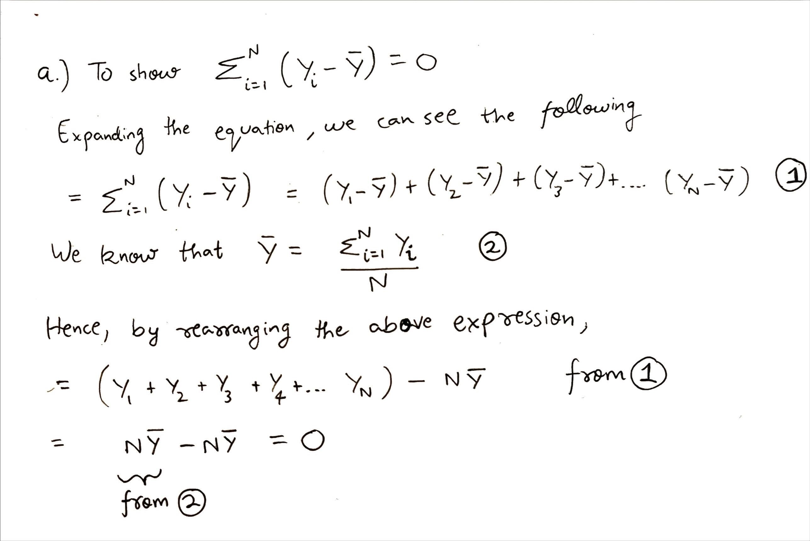
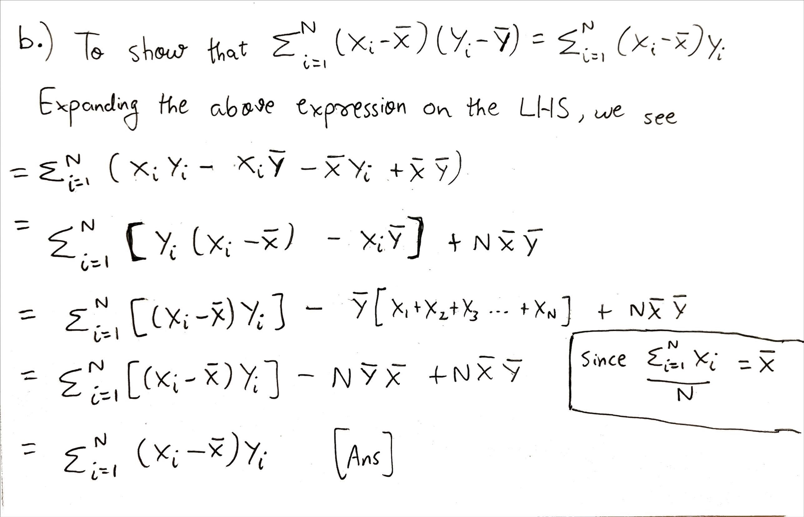

---
header-includes:
- \usepackage{amssymb, amsmath, amsthm}
- \usepackage{tabu}
- \newcommand{\E}{\mathbb{E}}
- \newcommand{\var}{{\rm Var}}
- \newcommand{\N}{\mathcal{N}}
output:
  html_document:
    df_print: paged
---

\noindent \begin{tabu} to \textwidth {@{}X[4 l] @{}X[r]}
  \textbf{Homework 1}           & \\ 
  \textbf{MSBA 400: Statistical Foundations for Data Analytics}   & \\ 
  \textbf{Professor Rossi}         & 
\end{tabu}

\bigskip


### Question 1

Review the basics of summation notation and covariance formulas. Show that:

a. $\sum_{i=1}^N (Y_i - \bar{Y}) = 0$
b. $\sum_{i=1}^N (X_i - \bar{X})(Y_i - \bar{Y}) = \sum_{i=1}^N (X_i - \bar{X})Y_i$

**Solution 1:**

a. $\sum_{i=1}^N (Y_i - \bar{Y}) = 0$




b. $\sum_{i=1}^N (X_i - \bar{X})(Y_i - \bar{Y}) = \sum_{i=1}^N (X_i - \bar{X})Y_i$




____

<br>
<br>

### Question 2

Define both and explain the difference between (a) the expectation of a random variable and (b) the sample average?


**Solution 2:**

**(a) The expectation of a random variable** is defined as the weighted average of values of a random variable, which is weighted by the probability of its occurance


**(b) The sample average** is defined as the simple mean of a sample from a probability distribution


**Difference between Expected Value of a random variable and the Sample Average?**
<br> Let's consider a Normal Distribution N(0,1) with mean equals 0 and standard deviation equals 1. Furthermore, lets take a sample of 10 from the above distribution for this example.


***Sample of 10 observations from a normal distribution*** 

> *rnorm(10, mean=0, sd=1)*

> [-0.24, 0.58, -0.76, 0.59, -2.28, -0.73, 2.47, 0.89, 1.90, -1.61]

**The difference between Expected Value and Sample Average in the context of this example would be-**


**1)** The sample average depends on the sample taken from the population. Every time we take a sample from a population, the sample average will change. In the above sample, the sample average is 0.082


**2)** The expected value of a random variable from the above distribution N(0,1) would essentially be equal to the mean, which is 0. It is evaluated based on the weighted average of all values the random variable can take and its probability. Since a random variable X ~ N(0,1) has the distribution centered around 0 and is symmetric on both sides, the Expected Value E(X) is equal to the mean, which is 0. It is a fixed value for a given distribution and doesn't depend on sampling


____

<br>
<br>

### Question 3

**a.** Describe the Central Limit Theorem as simply as you can.

**Solution 3.a.)**


***The Central Limit Theorem*** states that regardless of the distribution from which we take a sample, the distribution of the sample means will tend towards an approximately normal distribution as we increase the sample size. Furthermore, the mean of all sampled variables from the same distribution will be approximately equal to the population mean and the variances will approximately be equal to the variance of the population as the sample size gets larger, according to the law of large numbers.


<br>
<br>

**b.** Let $X \sim \textrm{Gamma}(\alpha=2,\ \beta=2)$. For the Gamma distribution, $\alpha$ is often called the "shape" parameter, $\beta$ is often called the "scale" parameter, and the $\mathbb{E}[X]=\alpha\beta$. Plot the density of $X$ and describe what you see. You may find the functions `dgamma()` or `curve()` to be helpful.

**Solution 3.b.)**


```{r}
# Answer:
library(repr)
options(repr.plot.width = 10, repr.plot.height = 6)

# Plotting the density of gamma function with shape parameter = 2 
# and rate (which is 1/scale) = 0.5
curve(dgamma(x, shape = 2, rate = 0.5), xlim = c(0,30), type = 'l', col = 'red', 
      main = "PDF for Gamma (alpha = 2, beta = 2)", ylab = "Probability Density")

```

If we change the shape and scale parameters of the gamma distribution, then we observe the following

```{r}
pl_par = par(mfrow=c(2, 2))
curve(dgamma(x, shape = 2, scale = 2), xlim = c(0,30), type = 'l', col = 'red', 
      main = "PDF for Gamma (alpha = 2, beta = 2)", ylab = "Probability Density")

curve(dgamma(x, shape = 2, scale = 4), xlim = c(0,30), type = 'l', col = 'blue', 
      main = "PDF for Gamma (alpha = 2, beta = 4)", ylab = "Probability Density")

curve(dgamma(x, shape = 4, scale = 2), xlim = c(0,30), type = 'l', col = 'green', 
      main = "PDF for Gamma (alpha = 4, beta = 2)", ylab = "Probability Density")

curve(dgamma(x, shape = 4, scale = 4), xlim = c(0,30), type = 'l', col = 'pink', 
      main = "PDF for Gamma (alpha = 4, beta = 4)", ylab = "Probability Density")
```


**Notes:** In the above PDF plot for Gamma Distribution, we can observe that the curve is skewed and has a long right-tail. The curve rapidly rises to its peak value and decreases with a long right-tail.

The influence of shape and scale parameter:

- Increasing the value of shape parameter shifts the peak of the distribution. As shape parameter increases, the peak shifts to the left as the expected value of the distribution increases (assuming scale parameter remains constant)

- Increasing the value of scale parameter reduces the peakedness of the distribution and the peak widens. Essentially, the distribution spreads as scale parameter increases


<br>
<br>

**c.** Let $n$ be the number of draws from that distribution in one sample and $r$ be the number of times we repeat the process of sampling from that distribution. Draw an iid sample of size $n=10$ from the Gamma(2,2) distribution and calculate the sample average; call this $\bar{X}_n^{(1)}$. Repeat this process $r$ times where $r=1000$ so that you have $\bar{X}_n^{(1)}, \dots, \bar{X}_n^{(r)}$. Plot a histogram of these $r$ values and describe what you see. This is the sampling distribution of $\bar{X}_{(n)}$.

**Solution 3.c.)**

```{r}
# Answer:

# Creating an empty list to store the sample averages
sample_avg_list <- rep(NA, 1000)

# Running a loop x1000 times to generate a sample of n=10 from a 
# gamma distribution and calculate it's sample average
for (i in 1:1000) {
    y_val = rgamma(10, shape = 2, rate = 0.5)
    sample_avg = sum(y_val)/length(y_val)
    sample_avg_list[i] = sample_avg
}

# Plotting the histogram of sample averages from the above 
# gamma distribution
options(repr.plot.width = 10, repr.plot.height = 6)
hist(sample_avg_list, col = 'light blue', 
     main = "Histogram of Sample Average with n = 10", 
     xlab = 'Sample Average of the sample from Gamma Distribution')
```


**Notes:** We observe that the distribution of sample means is approximately resembling a normal distribution. Even though the sampling was done from a gamma distribution, the sample means distribution resembles a normal distribution. As we increase the sample size, the distribution of sample means will tend towards a normal distribution (*as stated by Central Limit Theorem*)


<br>
<br>

**d.** Repeat part (c) but with $n=100$.  Be sure to produce and describe the histogram. Explain how this illustrates the CLT at work. 

**Solution 3.d.)**

```{r}
# Answer:

# Creating an empty list to store the sample averages
sample_avg_list <- rep(NA, 1000)

# Running a loop x1000 times to generate a sample of n=100 
# from a gamma distribution and calculate it's sample average
for (i in 1:1000) {
    y_val = rgamma(100, shape = 2, rate = 0.5)
    sample_avg = sum(y_val)/length(y_val)
    sample_avg_list[i] = sample_avg
}

# Plotting the histogram of sample averages from the above 
# gamma distribution
options(repr.plot.width = 10, repr.plot.height = 6)
hist(sample_avg_list, col = 'light blue', 
     main = "Histogram of Sample Average with n = 100", 
     xlab = 'Sample Average of the sample from Gamma Distribution')

```


**Notes:** As we increase the sample size from 10 to 100, we reduce the standard error of mean by a factor of the square root of 10. When we look at distribution of the new sample means (with n = 100), the distribution closely resembles a normal distribution. This exercise shows CLT at work. CLT states that as we increase the sample size of random variables from any distribution, the distribution of the sample means will tend towards a normal distribution.

Hence, we can see that the distribution of sample means (n=100) is a better approximation of normal distribution as compared to that of sample means (n=10)

____

<br>
<br>

### Question 4

The normal distribution is often said to have "thin tails" relative to other distributions like the $t$-distribution. Use random number generation in R to illustrate that a $\N(0,1)$ distribution has much thinner tails than a $t$-distribution with 5 degrees of freedom. 

A few coding hints: `rnorm()` and `rt()` are the functions in R to draw from a normal distribution and a $t$-distribution. The option `add=TRUE` for the `hist()` command can be used to overlay a second histogram on top of another histogram, and after installing the `scales` package, you can make a blue histogram 50\% transparent with the option `col=scales::alpha("blue",0.5)`. Alternatively, you can put two plots side-by-side by first setting the plotting parameter with the code `par(mfrow=c(1,2))`. You can set the range of the x-axis to go from -5 to 5 with the plotting option `xlim=c(-5,5)`.

**Solution 4:**

```{r}
# Sampling from T-distribution and from Normal Distribution
t_dist_values = rt(n= 1000,df = 5)
norm_dist_values = rnorm(1000,0,1)
```

```{r}
options(repr.plot.width = 12, repr.plot.height = 8)
c1 = rgb(173,216,230,max = 255, alpha = 80, names = "lt.blue")
c2 = rgb(255,192,203, max = 255, alpha = 80, names = "lt.pink")

min_val = min(c(t_dist_values, norm_dist_values))
max_val = max(c(t_dist_values, norm_dist_values))
ax = pretty(min_val:max_val, n = 30)


t_plot = hist(t_dist_values,
              plot = FALSE, breaks = ax)

norm_plot = hist(norm_dist_values, 
                 plot = FALSE, 
                 breaks = ax)

plot(t_plot,
     main = "Comparing T-Distribution vs. Normal Distribution Plots", 
     col = c1, 
     xlab = "x", 
     ylab = "Frequency")

plot(norm_plot, col = c2, add = TRUE)

legend(x = "topleft", 
       legend=c("T-Distribution", "Normal Distribution"), 
       fill = c(c1,c2))
```


**Notes:** In the above plot, we observe that the normal distribution has thinner tails relative to the $t$-distribution!


___


<br>
<br>

### Question 5

a. From the Vanguard dataset, compute the standard error of the mean for the `VFIAX` index fund return.
b.  For this fund, the mean and the standard error of the mean are almost exactly the same. Why is this a problem for a financial analyst who wants to assess the performance of this fund?
c.  Calculate the size of the sample which would be required to reduce the standard error of the mean to 1/10th of the size of the mean return.


**Solution 5:**

```{r}
# Loading the required libraries
library(DataAnalytics)
library(reshape2)

# Loading the Vanguard data
data(Vanguard)
head(Vanguard, n = 5)
```


```{r}
# Filtering the rows in the table to only retain ticker = 'VFAIX'
Van_vfiax = Vanguard[Vanguard$ticker == 'VFIAX',]
Van_vfiax = Van_vfiax[ , c("date","ticker","mret")]
head(Van_vfiax, n=5)
```


```{r}
# Reshaping the table to shift ticker to columns and 
# fill with monthly returns
Van_vfiax_reshaped = dcast(Van_vfiax, date~ticker, 
                           value.var="mret")
head(Van_vfiax_reshaped, n=5)
```


```{r}
# Descriptive statistics for the VFAIX ticker monthly data
descStat(Van_vfiax_reshaped)
```

<br>
<br> **a. From the Vanguard dataset, compute the standard error of the mean for the `VFIAX` index fund return.**
<br> **Ans.** The standard error of the mean is 0.004
<br>
<br>
<br> **b. For this fund, the mean and the standard error of the mean are almost exactly the same. Why is this a problem for a financial analyst who wants to assess the performance of this fund?**
<br> **Ans.** The standard error of the mean is of the same magnitude as that of the mean of monthly returns. This implies that the true mean monthly return for the VFIAX fund can significantly deviate from the estimated mean. Therefore, a financial analyst cannot confidently trust the mean monthly return for this fund. The 95% confidence interval varies from -0.003 to 0.011. Hence, investors can also lose money by investing in this fund.
<br>
<br>
<br> **c. Calculate the size of the sample which would be required to reduce the standard error of the mean to 1/10th of the size of the mean return.**
<br> **Ans.** 

The standard error of the mean is defined as follows-
$$
S_\bar{Y} = \frac{S_Y}{\sqrt{N}}
$$
So, if we want to reduce the standard error of the mean to 1/10th of the size of the mean return, then the number of observations required would be


```{r}
# Storing the summary statistics for the dataset
data_stats = descStat(Van_vfiax_reshaped)

# Required Standard Error of the Sample Mean is-
required_se_sample_mean = data_stats["VFIAX","Mean"]/10

# The Sample Standard Deviation is-
sample_sd = data_stats["VFIAX","SD"]

# As per the relationship between Sample Mean SE and Sample SD, the number of observations needed would be-
number_obs = ((sample_sd/required_se_sample_mean)^2)

print(paste0("The number of observations needed would be: ", sprintf(number_obs, fmt = '%#.0f')))
```


The key takeaway here is that to reduce the error to it's 1/10th value, we would need approximately 100x more observations (which is very high).
<br>

____

<br>
<br>

### Question 6 : Subsetting Observations


### Q6, Part A
1. Display the contents of the first 50 elements of the vector, `cars$make == "Ford"`, to verify that it is a logical vector.

```{r}
# Q.6 Part A (1)
# Loading mvehicles dataset
data(mvehicles)

# Filtering only cars from the mvehicles dataset
cars = mvehicles[mvehicles$bodytype != "Truck",]

# Printing the logical vector for cars$make == "Ford"
head(cars$make == "Ford", n=50)
```

<br>
<br>

2. Subset the `cars` data frame by a two step process to only the "Ford" make.  That is, create the row selection logical vector in one statement and select observations from the `cars` data frame in the second. 

```{r}
# Q.6 Part A (2)
# Creating logical vector where 'make' == 'Ford'
ford_logical = (cars$make == "Ford")

# Filtering using the above logical vector
ford = cars[ford_logical,]
head(ford, n = 3)
```

<br>
<br>


3. How many Kia observations are there in the `cars` data frame? hint: `nrow()` tells you how many rows are in a data frame.

```{r}
# Q.6 Part A (3)
print(paste0("Number of rows in 'cars' dataset where the", 
              " 'make' = Kia is ", 
             nrow(cars[cars$make == "Kia",])))
```

<br>
<br>

4. How many cars are have a price (emv) that is greater than $100,000?

```{r}
# Q.6 Part A (4)
print(paste0("Number of cars with expected market value (emv)", 
              " greater than $100,000 is ", 
             nrow(cars[cars$emv > 100000,])))
```

We can also couple two logical expressions together using AND `&` or OR `|`.  For example, if we want to select all rows with either Kia or Hyundai; we would say `cars[cars$make == "Kia" | cars$make == "Hyundai",]`.

<br>
<br>

### Q6, part B

1. What is the average sales for all cars made in Europe with price above $75,000?

In many data sets, there are long text fields whcih describe an observation.  These fields are not formatted in any way and so it is difficult to use simple comparison methods to fetch observations.  However, we can use the power of something called regular expressions to find any observations for which a given variable contains some character pattern.  Regular expressions are very complicated to use in generality but we can get a lot of use out of a very simple expression.

The `style` variable in `cars` is a general text description variable,  We can find the rows for each `style` contains any string by using the command `grepl("string",column,ignore.case=TRUE)`. For example, `grepl("hybrid",cars$style,ignore.case=TRUE)` creates a logical vector (TRUE or FALSE) to help select rows corresponding to hybrids.  `cars[grepl("hybrid",cars$style,ignore.case=TRUE),]` will fetch only hybrids.


```{r}
print(paste0("Average sales of all cars made in Europe with price above $75,000: ",
             sprintf(mean(cars[(grepl("Europe",cars$origin,ignore.case = TRUE) & 
                        (cars$emv > 75000)),c("sales")]), fmt = '%#.0f')))
```

<br>
<br>

### Q 6, part C

1. How many four door vehicles are in cars?
2. How many four door sedans are in cars?

```{r}
# To identify cars with 4 doors by searching for '4dr' in the 'style' column of the dataset
print(paste0("Number of cars with four doors: ",
             nrow(cars[grepl("4dr",cars$style,ignore.case = FALSE),])))
```


```{r}
# To identify Sedan with 4 doors
print(paste0("Number of Sedans with four doors: ",
             nrow(cars[(grepl("4dr",cars$style,ignore.case = FALSE) & 
                        grepl("Sedan",cars$bodytype,ignore.case=TRUE)),])))
```

___


<br>
<br>

### Question 7 : Sales and Price relationships


In this question, use `cars` only.

### Q7, part A
Plot price (horizontal axis) vs. sales (vertical axis) for cars with bodytype == "Sedan". What is the problem with displaying the data in this manner?

```{r}
# Filtering the cars dataset to only retain "Sedan"
car_dat = cars[grepl("Sedan",cars$bodytype,ignore.case=TRUE), 
               c("emv", "sales")]

# Plotting Price (emv) vs. Sales
plot(x = car_dat$emv, y = car_dat$sales, 
     main = "Price (emv) vs. Sales Scatter Plot for Sedans", 
     ylab = "Sales", xlab = "Price (emv)")
```


**Notes:** The problem with displaying data in this manner is that we cannot extract any meaningful insights from the plot. Both "Sales" and "Price" have a large range of values, where most of the data points lie on the lower end. Hence, when we plot data in this manner, we cannot extract any meaningful insigths regarding the relationship between Sales and Price.


<br>
<br>

### Q7, part B

Plot log(price) vs. log(sales) for the same subset of observations as in part 1.  How has this improved the visualization of this data? Are there any disadvantages of taking the log transformation?  A very similar but less "violent" tranformation is the sqrt transformation.  Try the sqrt transformation.  Is this useful? 


```{r}
# Plotting Log(Price) vs. Log(Sales)
plot(x = log(car_dat$emv), y = log(car_dat$sales), 
     main = "Log of Price (emv) vs. Log of Sales Scatter Plot for Sedans", 
     ylab = "log(Sales)", xlab = "log(Price)")
```


**Notes:** By taking a log transformation of Sales and Price, we can observe all data points in a much better manner. We can also extract some meaningful insights from this plot. We observe that as price increases, the sales decrease in general. Log transformation has helped scale down outliers in the data and bring them together with the larger population of data points.

The disadvantage of doing the log transformation is that the numbers won't be intuitive. So we cannot properly interpret log(Sales) and log(Price). E.g. It is difficult to compare `log(Price) = 12` vs. `log(Price) = 9` and how that impacts sales

```{r}
# Plotting Sq. Root(Price) vs. Sq. Root(Sales)
plot(x = sqrt(car_dat$emv), y = sqrt(car_dat$sales), 
     main = "Sq. root of Price (emv) vs. Sq. root of Sales Scatter Plot for Sedans", 
     ylab = "Sqrt(Sales)", xlab = "Sqrt(Price)")
```


**Notes:** The square root transformation helps by bringing the data points with large Price or Sales closer to the remaining data points on the lower end of the scale. It also closely resembles the distribution pattern observed in the original scatter plot. However, it still suffers from interpretability. The units of the values (e.g. $) don't make sense when we take the square root.


<br>
<br>

### Q7, part C

Economists will tell you that as price increase sales will decreases, all other things being equal.  Does this plot support this conclusion?

<br>**Ans)** In the above plots we can observe that in general as the price increases the Sedan sales decrease 


<br>
<br>

### Q7, part D
Fit a regression model to this data. That is, "regress" log(sales) on log(price) (log(sales) is Y or the dependent variable). Plot the fitted line on top of the scatterplot using `abline`.  


```{r}
# Plotting the best fit line
plot(x = log(car_dat$emv), y = log(car_dat$sales), 
     main = "Log of Price (emv) vs. Log of Sales Scatter Plot for Sedans", 
     ylab = "log(Sales)", xlab = "log(Price)")
abline(lm(log(sales) ~ log(emv), data = car_dat), col = "red")
legend(x = "topright", legend=c("Best Fit Line"), fill = c("red"))
```


<br>
<br>

### Q7, part E
Predict sales for price = $45,000 using the model fit in part D). Don't forget to transform back to unit sales by using the `exp()` function. 

```{r}
# Fitting a line using linear model
regress_sales_price = lm(log(sales) ~ log(emv), data = car_dat)
regress_sales_price
```


```{r}
# Predicting the sales of a Sedan which is priced at $45,000
print(paste0("The predicted sales of a Sedan which is priced at $45,000 is ",
             sprintf(exp(predict(regress_sales_price, new = data.frame(emv = 45000))),
                     fmt = '%#.0f')))
```

